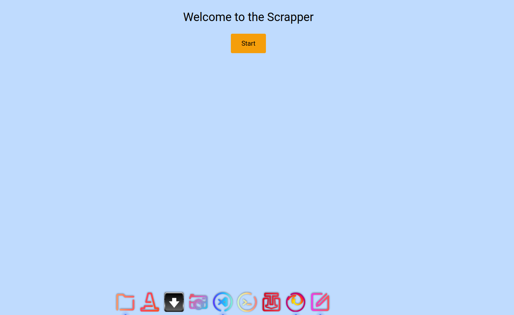
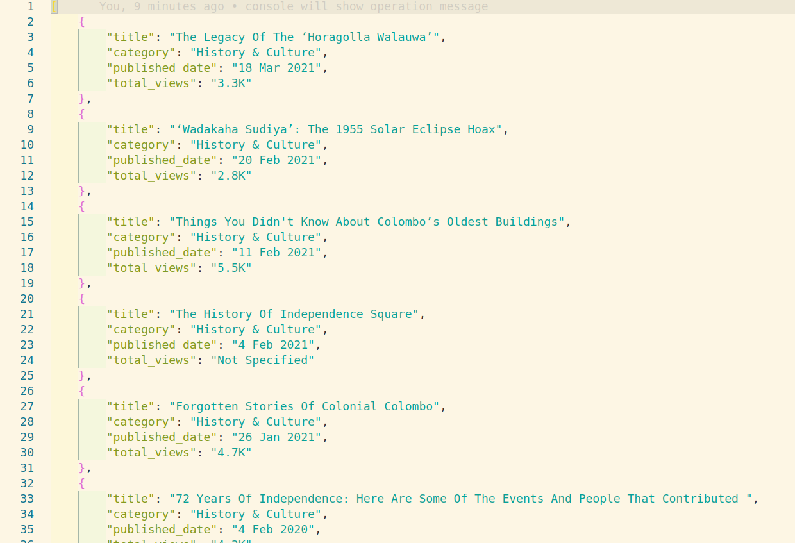

# Web Scrapper

## About the project

A scrapper will collect some public data from Roar media. The data will then be saved in a json file, then also saved in mongodb database.

<hr>

## Demo

<table>
  <tr>
    <td>index</td>
  </tr>
  <tr>
    <td></td>
  </tr>

   <tr>
    <td>site</td>
  </tr>
  <tr>
    <td></td>
  </tr>

  <tr>
    <td>collected</td>
  </tr>
  <tr>
    <td></td>
  </tr>
   
 </table>
<br/><hr><br/>

## Stacks

- Python
- Flask
- Selenium
- BeautifulSoup
- MongoDB
- Tailwind CSS

<br/><hr><br/>

## Features

```
1. collects data from website
2. saves data in json file
3. saves data in mongoDB atlas
```
